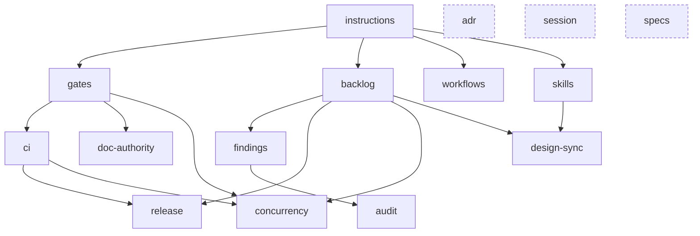

# Module catalog

> Phase 4. Written 2026-08-14. **Authoritative for:** the module set — identity, rung, dependencies,
> conflicts, parameters, and what each ships. **Not authoritative for:** the pattern definitions
> (those are [pattern-catalog.md](../research/pattern-catalog.md)), the module file format
> ([ADR-0003](../decisions/ADR-0003-module-definition-format.md)), or detection
> ([ADR-0004](../decisions/ADR-0004-adoption-detection.md)).

Turns the ~80 extracted patterns into an installable set. Every module cites the patterns it
implements; **it does not restate them.**

---

## 1. The set

**15 modules.** Rung is the [maturity ladder](../research/synthesis.md#5-the-maturity-ladder) —
`add` states it and asks for confirmation when a repo is installing above its level.

| Module | Rung | Depends on | What it is |
| --- | --- | --- | --- |
| [`instructions`](#instructions) | 0 | — | The entry point, the bridge, path-scoped rules, and the render pipeline |
| [`gates`](#gates) | 1 | `instructions` | The runner, the registry, the ledger, and the structural gate set |
| [`backlog`](#backlog) | 1 | `instructions` | Work items with ids, a lifecycle, and a board |
| [`findings`](#findings) | 1 | `backlog` | The register for what is noticed before it is decided |
| [`adr`](#adr) | 1 | — | Decision records, with an admission rule |
| [`session`](#session) | 1 | — | Handoff state across sessions |
| [`ci`](#ci) | 1 | `gates` | Matrix workflows, and a proliferation check |
| [`specs`](#specs) | 2 | — | Behaviour specs with story ids and honest status |
| [`workflows`](#workflows) | 2 | `instructions` | Decision procedures — reuse, tiering, decomposition |
| [`skills`](#skills) | 2 | `instructions` | Skill-authoring discipline, and the gates that hold it |
| [`audit`](#audit) | 2 | `findings` | An audit procedure whose output is rows, not documents |
| [`release`](#release) | 3 | `backlog`, `ci` | Candidate/release lines, and the release procedure |
| [`design-sync`](#design-sync) | 3 | `backlog`, `skills` | An external design authority, synced two ways |
| [`doc-authority`](#doc-authority) | 4 | `gates` | Topic ownership, and rule propagation across surfaces |
| [`concurrency`](#concurrency) | 5 | `backlog`, `gates`, `ci` | Many sessions on one integration branch |

### Dependency graph

`adr`, `session` and `specs` (dashed) have no dependencies — they can be installed alone.

**Three dependencies exist because a source repo violated them** and paid:

- `audit → findings → backlog` — `hexguard` ran a good audit prompt 268 times into 268 documents,
  because no register existed to hold rows and no work-item object existed to close them into.
- `workflows → skills` (soft: `skills` supplies the invocation discipline) —
  `hexguard-templates`'s 9-step procedure is the best in the corpus and its `AGENTS.md` reads
  *"placeholder for future additions."*
- `doc-authority → gates` — `axiom-mesh`'s non-negotiable doc rules were enforced by review only,
  and decayed inside the file that states them.

`add` refuses to install a module whose dependencies are unmet, naming the incident.

---

## 2. Module specifications

Each entry: **rung · deps · conflicts · params · ships · cost · provenance**. `ships` uses
ADR-0003's dispositions — `files` (create) · `rules` (render) · `skills` (copy) · `fragments`
(merge) · `gates` (declare). *(A sixth, `docs`, was dropped from ADR-0003 on first use — it had the
same disposition as `files`.)*

### `instructions`

**Rung 0 · deps: none · conflicts: none**

The only module every repo installs. Owns [ADR-0001](../decisions/ADR-0001-multi-harness-rendering.md)'s
entire output surface.

**Authored 2026-08-14 — [`modules/instructions/`](../../modules/instructions/).**

- **params:** `harnesses` (list: `claude`, `copilot`, `cursor`, `agents-md`) · `core_budget`
  (default `200` lines — vendor guidance, see [harness-landscape §3](../research/harness-landscape.md))
- **files:** `AGENTS.md` skeleton (identity · non-negotiables · repo map · **validation matrix** ·
  routing) · `CLAUDE.md` bridge · `.ai/rungs.toml` · `.ai/rules/` scaffold
- **fragments:** owns `AGENTS.md` and `.gitignore` — every other module merges into them
- **gates:** `core-size` (declared — core over budget) · `render-current` (declared —
  `generate-derivable`) · `repo-map-current` (declared) · `shell-backticks` (**hook**, Claude only)
- **cost:** one file to keep true; re-render on rule edits
- **implements:** `entry-point` `agents-md-bridge` `scoped-instructions` `core-size-budget`
  `validation-matrix` `repo-map` `narrowest-anchor-loop` `negative-conventions` `comms-style`
  `shell-editing-rules`
- **provenance:** 4/4 repos for the entry point; `hexguard` for scoping; `rift-forge` for the
  bridge and the shell rules — *documented, then broken three more times, then made a hook*

### `gates`

**Rung 1 · deps: `instructions` · conflicts: none**

Owns the runner, the registry, and the ledger. Every other module registers its gates here rather
than emitting scripts ([ADR-0002](../decisions/ADR-0002-stack-and-runtime-footprint.md)).

**Authored 2026-08-14 — [`modules/gates/`](../../modules/gates/).** Its own gate set was trimmed
during authoring: `ids-unique` and `generated-current` were listed here but are *module-specific*
(`backlog-ids`, `instructions-render-current`), and what `gates` actually contributes is the
**engines** they run on. What it keeps is repo-agnostic — plus two that no source repo had:
`rules-declare-enforcement` (failure mode F1 made detectable) and
`self-tests-both-directions` (the meta-gate).

- **params:** `tiers` (default `fast`, `full`) · `ledger` (default `on`)
- **files:** `.ai/gates.toml` registry · ledger `.gitignore` entry
- **gates:** the structural set, all `declared` — `links-resolve` · `ids-unique` ·
  `required-sections` · `referenced-paths-exist` · `frontmatter-valid` · `generated-current`
- **cost:** near-zero to run; the runner is invoked as `npx rungs check`
- **implements:** `structural-gates` `gate-self-test` `read-the-negation` `reasoned-exemption`
  `computed-claims` `generate-derivable` `enforcement-declaration` `ageing-signal` `tool-level-hook`
- **provenance:** `rift-forge` — 42 `check:` gates with 27 self-tests, and 82 registry entries with
  hand-typed durations that motivated the ledger

> **`enforcement-declaration` is enforced here**: every rule any module generates is tagged `gated`
> or `review-only`, and `doctor` reports rules that claim MANDATORY with no gate behind them. This
> is the module that makes failure mode F1 detectable.

### `backlog`

**Rung 1 · deps: `instructions` · conflicts: none**

**Authored 2026-08-14 — [`modules/backlog/`](../../modules/backlog/) is the format exemplar.**

- **params:** `id_prefix` (default `WI`) · `root` (default `backlog`) · `integration_branch`
  (default `main`) · `branch_prefix` (default `feature`)
- **files:** `docs/{{root}}/README.md` (the methodology) · `BACKLOG.md` board · `TEMPLATE.md` ·
  `items/`
- **skills:** `work-item` (execute one end to end) · `backlog-summary` (per-category open items,
  ranking, workflow health)
- **fragments:** an `AGENTS.md` block naming the id scheme and the branch convention
- **gates:** `ids` (declared — uniqueness, citation integrity) · `stale-blocker` (declared — *a doc
  may not say it is waiting for work that has finished*) · `merged-status` (declared,
  one-directional — *a merged branch cannot still be awaiting review*)
- **cost:** one file per unit of work; a status field to keep true
- **implements:** `work-item-lifecycle` `item-template-required-fields` `branch-per-item`
  `planning-rides-trunk` `scope-discipline` `epics-and-subitems` `bookkeeping-gates`

> **`sprint-archive` and `backlog-spaces` were listed here and are deferred**, found while
> authoring. Both are *optional* sections of the methodology, and ADR-0003 has no conditionals —
> so shipping them here would put sprint ceremony in front of every repo that installs a backlog.
> The evidence says defer: **none of the four source repos started with sprints and only one ended
> with them** (`rift-forge`, at 4 sprints against 543 archived items). What `backlog` keeps is
> plain **archive-on-demand**, since a container outgrowing itself is a rung-1 problem. Sprints
> become a rung-2 `sprints` module when a repo needs them.
- **provenance:** `rift-forge` — 102 live + 543 archived items; the two bookkeeping gates caught
  **37 items** at `review` with code already landed, and one `in_progress` **eight days** past its
  own merge

### `findings`

**Rung 1 · deps: `backlog`**

- **params:** `id_prefix` (default `F`) · `path` (default `docs/{{backlog.root}}/FINDINGS.md`)
- **files:** the register + its README
- **skills:** `record-finding` — record, and triage (promote · fix · dismiss **with a reason**)
- **gates:** `findings-ids` (declared) · `dismissed-has-reason` (declared)
- **cost:** near-zero per finding — that is the point
- **implements:** `findings-log` `record-without-derailing` `finding-promotion` `audit-to-register`
- **provenance:** `rift-forge` — 91 findings. **A finding is the observation; a work item is the
  decision.** The object `hexguard` lacked under 268 audit reports

### `adr`

**Rung 1 · deps: none · conflicts: none**

- **params:** `path` (default `docs/decisions`) · `id_format` (default `ADR-####`)
- **files:** `index.md` with the **admission rule** · `TEMPLATE.md`
- **gates:** `adr-index-current` (declared) · `adr-admission-fields` (declared)
- **cost:** one record per constraining decision — the admission rule is what keeps that small
- **implements:** `adr-record` `adr-admission-rule`
- **provenance:** `axiom-mesh` — 48 ADRs stayed navigable *because* most candidates were routed
  elsewhere by a five-criterion gate

### `session`

**Rung 1 · deps: none · conflicts: none**

- **params:** `mode` — `file` (an `axiom-mesh`-style handoff doc) or `board` (derive from the
  backlog; cheaper, less narrative). Default `board` when `backlog` is installed
- **files:** `.ai/session.md` with fixed sections · `.ai/archive/`
- **gates:** `session-sections-present` (declared) · `archive-named` (declared)
- **cost:** a few minutes per session close, in `file` mode
- **implements:** `session-handoff` `settled-decisions-lock` `dated-session-archive` `board-as-state`
- **provenance:** `axiom-mesh` — 21 dated archives, and the *"Active Constraints / Decisions Since
  Last Archive"* section that stops a fresh session relitigating settled questions

### `ci`

**Rung 1 · deps: `gates`**

- **params:** `provider` (default `github`) · `trigger` (`push` | `land`)
- **files:** one workflow calling `npx rungs check`, **matrix over packages** where relevant
- **gates:** `workflow-proliferation` (declared — near-identical workflow files over a threshold)
- **cost:** CI minutes; the `land` trigger option exists because they are billed
- **implements:** `matrix-not-per-item-ci` `workflow-proliferation-check` `ci-at-land-time`
- **provenance:** `hexguard` — **98 near-identical per-package release workflows**, because a phase
  checklist told the agent to add one each time. The proliferation gate exists so that cannot
  recur silently

### `specs`

**Rung 2 · deps: none**

- **params:** `path` (default `docs/specs`) · `id_format` (default `<PREFIX>-F##` / `<PREFIX>-US-###`)
  · `split_lines` (default `600`)
- **files:** `README.md` conventions · spec template with a **mandatory scope section**
- **gates:** `spec-status-evidence` (declared — a ✅ story names the commit that closed it; a 🟡
  carries its note) · `spec-ids-unique` (declared)
- **cost:** a spec per surface; status kept per story
- **implements:** `spec-ids-and-status` `mandatory-scope-section` `demo-not-done` `split-threshold`
  `reference-implementation-pointer` `adoption-guide`
- **provenance:** `hexguard-templates` — *"Demo ≠ done… a spec that overclaims integration is worse
  than no spec"*, which needed a gate more than it needed a sentence

### `workflows`

**Rung 2 · deps: `instructions`**

Decision procedures. Content, not mechanism — the mechanism is `skills`.

- **params:** `upstream_repo` (enables the extend-upstream branch of the reuse table)
- **rules:** the reuse decision table · doc-tier selection · per-concern decomposition
- **skills:** `implement-story` (or `implement-item`) — the numbered end-to-end procedure
- **docs:** the authority doc the rules cite
- **cost:** authoring only; Tier 0 means trivial work stays undocumented
- **implements:** `reuse-decision-table` `second-consumer-threshold` `doc-tier-selection`
  `per-concern-decomposition` `multi-story-batching` `numbered-workflow-steps` `phase-checklist`
  `lifecycle-verbs` `controlled-performance-comparison`
- **provenance:** `hexguard-templates` — *"Use this table instead of 'use judgment'"*, and **Tier 0
  must exist** or the process gets routed around

### `skills`

**Rung 2 · deps: `instructions`**

Not "the ability to have skills" — every module ships skills via ADR-0003. This is the **authoring
discipline and the gates that hold it.**

- **params:** `dir` (resolved by harness set per ADR-0001: `.claude/skills/` or `.agents/skills/`)
- **rules:** how to write a `description:` that routes · the neighbour convention
- **gates:** `skill-spec-pure` (declared — frontmatter restricted to the six Agent Skills fields
  unless extensions are opted in) · `skill-names-neighbours` (declared) ·
  `skill-writes-artifact` (declared — a skill's body names where its output lands)
- **cost:** near-zero
- **implements:** `invocable-procedure` `skill-neighbours` `prompt-writes-artifact`
  `operating-skills` `prompt-index-routing` `external-reasoning-prompt` `model-selection-prompt`
- **provenance:** `rift-forge` (13 skills, each naming its neighbours because at that count
  descriptions alone stop disambiguating) · `axiom-mesh` (21 playbooks with no invocation surface,
  whose content is directly portable now that SKILL.md is a standard)

### `audit`

**Rung 2 · deps: `findings`**

- **params:** `subject` (what gets audited: `package`, `service`, `surface`) · `criteria` (list)
- **skills:** `assess-<subject>` — run the criteria, **emit rows into the findings register**
- **gates:** `audit-output-is-rows` (declared — refuses a per-subject document tree)
- **cost:** one run per subject; the register absorbs the output
- **implements:** `audit-to-register` `lifecycle-verbs`
- **provenance:** `hexguard` — the audit *prompt* was good enough to run **268 times**; the output
  form was the defect. This module exists to keep the prompt and change the output

### `release`

**Rung 3 · deps: `backlog`, `ci`**

- **params:** `lines` (`candidate` / `main` / `release/<version>`) · `changelog` (`changelog.d` |
  `keepachangelog`) · `version_scheme`
- **skills:** `cut-release` — gates → bump → changelog → tag → deploy branch → next candidate, plus
  **hotfix and rollback**
- **gates:** `changelog-entry-present` (declared) · `version-consistent` (declared)
- **cost:** one procedure per release
- **implements:** `candidate-and-release-lines` `release-skill`
- **provenance:** `rift-forge`

### `design-sync`

**Rung 3 · deps: `backlog`, `skills`**

- **params:** `source` (the external design authority) · `mirror` (default `design-system/`)
- **skills:** `design-pull` (down-sync only) · `design-align` (route **every** delta to a backlog
  item, a phase-gated future item, or an upstream change request)
- **gates:** `design-deltas-routed` (declared — no delta without a destination)
- **cost:** one pull-and-align pass per upstream change
- **implements:** `external-authority-precedence` `two-way-design-sync`
- **provenance:** `rift-forge` (industrialized) · `hexguard-templates` (the precedence rule: the
  design project is *"layout/visual guidance, not a functional spec"*). **Never silent divergence**

### `doc-authority`

**Rung 4 · deps: `gates`**

For repos where several documentation surfaces restate each other. Expensive, and the highest-value
module in the catalog when it applies.

- **params:** `registry_path` · `scope_headers` (bool)
- **files:** `doc_ownership.md` — topic · authoritative doc · **must NOT appear in**
- **gates:** `ownership-respected` (declared — the must-not-appear-in column, checked by term) ·
  `scope-headers-present` (declared) · `working-rules` (declared — rule × surfaces propagation) ·
  `no-redirect-stubs` (declared)
- **cost:** ongoing rule curation — a real recurring cost, stated at install
- **implements:** `doc-ownership-registry` `scope-headers` `stub-rule` `no-paraphrase`
  `no-redirect-stubs` `working-rule-propagation` `defect-register-split` `inline-gap-callout`
- **provenance:** **`axiom-mesh`'s registry married to `rift-forge`'s gate — the combination
  neither repo has.** `axiom-mesh` wrote the best ownership model in the corpus and checked none
  of it; `rift-forge` built the propagation gate after measuring **five working rules that had
  changed and reached none of the files that teach them**

### `concurrency`

**Rung 5 · deps: `backlog`, `gates`, `ci`**

> **`add` states the threshold and requires confirmation: below ~5 concurrent sessions on one
> integration branch this is pure overhead.** Selling this to a rung-1 repo is the most likely way
> this tool does harm.

- **params:** `integration_branch` · `green_ref` · `worktree_root`
- **files:** `.gitattributes` merge-driver declarations · setup script
- **gates:** `no-integration-checkout` (declared) · `generated-not-text-merged` (driver)
- **cost:** high — a real tooling surface with its own failure modes
- **implements:** `green-ref` `failure-attribution` `land-protocol` `lock-not-checkout`
  `no-pre-land-full-verify` `preflight` `conflict-classes` `regenerate-never-merge` `id-claiming`
  `worktree-lifecycle` `ci-at-land-time`
- **provenance:** `rift-forge` at 401 branches and 51 worktrees. Ships with its corrections
  included: the checkout-based lock that blocked every session *and did not work*, and the
  pre-land full verify that caused **three of five refused lands**

---

## 3. Deliberately not modules

The pattern catalog is research; not every pattern earns a module.

| Pattern | Why not | Where it goes |
| --- | --- | --- |
| `contract-test-base` (§L) | Language-specific — an xUnit/.NET idiom. [Brief §4](product-brief.md): nothing stack-specific becomes a module | Stays documented in the pattern catalog |
| `golden-tests` (§L) | A convention about *which* tests exist, not a structure to install | A `workflows` rule: never weakened, changes are a documented event |
| `shell-editing-rules` (§L) | One rule plus one hook | Folded into `instructions` |
| `vocabulary-table` (§A) | A doc with an owner, not machinery | `doc-authority` when installed, else a plain doc |
| `milestone-overlay` (§B) | An alternative unit of work, not a separate capability | A `backlog` param variant |

**A `testing` module was specified in [pattern-catalog §L](../research/pattern-catalog.md)'s
proposed set and is dropped here.** Its three patterns split cleanly into the three rows above, and
what remained was stack-specific. That proposal was written before ADRs 0002–0003 set the
no-stack-specific boundary.

---

## 4. Install profiles

`rungs init` offers these rather than a checkbox list of 15:

| Profile | Modules | For |
| --- | --- | --- |
| **minimal** | `instructions` | Any repo with an agent |
| **tracked** | + `gates` `backlog` `findings` `adr` `session` | More than one work item in flight — **the rung two of four source repos never reached** |
| **disciplined** | + `ci` `specs` `workflows` `skills` `audit` | Repeated work of the same shape |
| **hardened** | + `release` `doc-authority` | Rules that have been broken at least once |
| **fleet** | + `concurrency` `design-sync` | 5+ concurrent sessions |

Profiles are starting points; `add` and `remove` work per module afterwards.

---

## 5. Corpus expectation matrix

Per [ADR-0004 §5](../decisions/ADR-0004-adoption-detection.md), **a module whose `[detect]` block
misclassifies any of the four source repos is not finished.** This is the Phase 6 acceptance
criterion, stated up front.

`C` create · `A` adopt · `P` partial (adopt + install the gap) · `¶` paradigm difference, report
only · `—` not applicable

| Module | `rift-forge` | `axiom-mesh` | `hexguard` | `hexguard-templates` |
| --- | --- | --- | --- | --- |
| `instructions` | **P** — adopt `CLAUDE.md`, flag 1513 lines vs. 200, invert the bridge | **P** — adopt `.ai/instructions.md`, add `AGENTS.md` | **A** — 7 scoped files already | **A** |
| `gates` | **P** — **adopt 82 gates as `command`, install the ledger.** The headline case | **P** — adopt 8 `.ps1` validators as `command` | **C** | **C** |
| `backlog` | **A** — superset; install nothing | **¶** — milestones vs. work items | **P** — adopt `docs/.ai/backlog/`, add lifecycle | **C** |
| `findings` | **A** | **P** — adopt `AD-###` + `DF-###` (two registers) | **C** — *the 268-report fix* | **C** |
| `adr` | **A** | **A** — 48 ADRs + admission rule | **P** — 4 workflow decisions, no admission rule | **C** |
| `specs` | **A** | **¶** — authority docs by topic, not story specs | **—** | **A** — superset |
| `workflows` | **P** | **P** — 21 playbooks | **P** | **A** — superset, *uninvocable* |
| `skills` | **A** — 13 skills | **C** — **converts 21 playbooks to skills** | **P** — 3 prompts + 1 agent | **C** — *fills the placeholder* |
| `audit` | **C** | **P** | **P** — keep the prompt, change the output | **P** |
| `doc-authority` | **P** — has `working-rules`, lacks the registry | **P** — **has the registry, lacks every gate** | **C** | **C** |
| `concurrency` | **A** — the source of the module | **—** below threshold | **—** | **—** |

The two cells that justify the whole product: **`gates` on `rift-forge`** (it has more gate
machinery than anyone and no ledger, and gets one without a single file of its own being touched)
and **`doc-authority` across `axiom-mesh` + `rift-forge`** (each has exactly the half the other
lacks).

---

## 6. Next

1. ~~Author `modules/backlog/` in full~~ — **done 2026-08-14**,
   [`modules/backlog/`](../../modules/backlog/). The format survived, with two amendments it
   forced: ADR-0003's redundant `docs/` disposition was dropped, and `sprint-archive` /
   `backlog-spaces` were deferred out of this module because substitution-only templating cannot
   make a section optional.
2. ~~**`instructions` and `gates`**~~ — **done 2026-08-14**. The `tracked` profile's spine is
   authored: the two modules that own every shared surface the others merge into.
3. ~~Then `findings`, `adr`, `session`~~ — **done 2026-08-14. The `tracked` profile is complete**:
   six modules, every rung-0 and rung-1 module in the catalog.
4. ~~Then rung 2, then rung 3+~~ — **done 2026-08-14. All fifteen modules are authored.**
   Phase 4 is complete.
5. **Phase 5.** Nothing has been executed yet: every finding so far came from *writing* modules,
   not running them. The `[detect]` blocks are unverified claims and the gate tables describe
   engines that do not exist. The first executable milestone is `render` plus `doctor` on the
   four source repos, which is also Phase 6's acceptance criterion arriving early.

**Still unexercised by the three authored modules**, and therefore unproven: a module with more
than one `rules/` file; a live `command` gate (`gates` documents the kind and adopts into it, but
ships none); a `conflicts` entry; and the `detect.paradigm` path, which needs `axiom-mesh` in front
of it to be tested honestly.

**Format findings so far — eleven across six modules, all applied to their sources rather than
noted.** ADR-0003's redundant `docs/` disposition dropped · `sprint-archive`/`backlog-spaces`
deferred because substitution-only cannot make a section optional · hooks resolved as a gate
*trigger*, not a sixth thing a module ships · markers use the target file's comment syntax ·
fragments count against the entry document's line budget · optional prose ships commented out ·
substitution vs. behavioural parameters (`consumed_by`) · cross-module parameter references for
declared dependencies · a path parameter may contain separators · a parameter meaning "do nothing"
is the absence of the module · and one dead parameter caught only by auditing all six at once.

Rung 2 added three more, one of them the most consequential yet:

- **`${{ … }}` is never substituted** — GitHub Actions expressions share the delimiter, so without
  a `$`-passthrough rule the `ci` module silently corrupts its own workflow file at install.
- **A behavioural parameter reaches file content through a managed block**, never a conditional
  (`ci.trigger` regenerates the `on:` block).
- **A fragment is a routing stanza, not a summary.** Found by assembling the whole profile: a
  73-line skeleton plus ten ~12-line fragments is 193 of the 200-line budget with **nothing left
  for the repo's own conventions**. The budget binds at profile scale, not per module — which no
  single module could have revealed. Rewritten as routing stanzas the profile assembles to
  **134**, leaving 66.

Rung 3+ added two more: **a parameter never holds a value decided at runtime** (`release` first
declared `candidate/{{version}}`, referencing a version that does not exist at install time), and
**a module may declare a `[threshold]` with `confirm = true`** — used only by `concurrency`,
because the maturity ladder is advice until something enforces it.

**Sixteen findings across fifteen modules**, and the character changed twice: the early ones were
corrections to the format, the middle ones were constraints only visible when modules compose, and
the last were refinements. A full fifteen-module install assembles to **165 of the 200-line
budget**.
