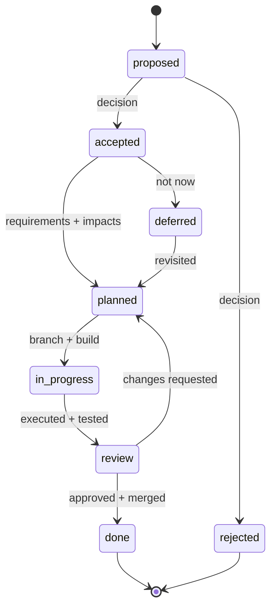

**Authoritative for:** how work is proposed, decided, planned, executed and reviewed, and the meaning of each status.
**Not authoritative for:** what any individual item contains, and what the code should look like — see the engineering guides.

# Delivery methodology & backlog

How work is proposed, decided, planned, executed, and reviewed here — and where it is tracked.
**Mandatory for all contributors, including AI agents.**

This tracks **units of work and their state**. It does not describe behaviour (that is a spec) or
record decisions (that is an ADR).

---

## 1. Lifecycle

Every unit of work is a **work item** with a stable id (`{{id_prefix}}-###`) and a status:

| Status | Meaning |
| --- | --- |
| `proposed` | An idea captured with **rationale**; awaiting a decision |
| `accepted` | Approved to pursue; not yet planned in detail |
| `rejected` | Declined; kept for the record **with the reason** |
| `deferred` | Accepted in principle but intentionally **not now**, with a revisit trigger |
| `planned` | Requirements, impacts, approach and acceptance criteria written; ready to build |
| `in_progress` | Being executed on its branch — **the "current" work** |
| `review` | Executed and tested; under review against the acceptance criteria |
| `done` | Approved, merged to `{{integration_branch}}`, acceptance criteria met |

## 2. Workflow

1. **Propose** — open an item (`proposed`) stating the problem and **why it matters**. Anyone may
   propose.
2. **Decide** — accept, reject, or defer. Record the decision **and its reason** in the item. A
   rejection is final unless re-proposed with new information.
3. **Plan** — for an `accepted` item write **requirements**, **impacts**, **approach** (with
   options and trade-offs where relevant), **acceptance criteria**, and **out of scope**.
   Significant design choices get an ADR. Status → `planned`.
4. **Execute + test** — branch, build, test. Status → `in_progress`, then `review`.
5. **Review** — verify against the acceptance criteria, reconcile any specs or ADRs, merge.
   Status → `done`. Changes requested → back to `planned` / `in_progress`.

**Planning artifacts ride `{{integration_branch}}`.** Proposals, decisions and plans precede
execution and do not need a branch; only *code* does.

## 3. Ids

Ids are permanent and never reused, including after archiving. `BACKLOG.md` carries the
`NEXT-ID` marker; claim from it and bump it **on your own branch**.

An id spent in a branch name or a commit subject without bumping the marker is invisible to the
check, which reads the working tree. Bump first.

## 4. Branches

`{{branch_prefix}}/{{id_prefix}}-###-slug`, cut from `{{integration_branch}}` and merged back on
review. Use `chore/`, `docs/` and `spike/` for non-feature work. **Delete the branch on merge.**

## 5. Definition of done

- Acceptance criteria met and demonstrated
- Tests written and passing; existing tests not weakened
- Docs updated where public behaviour or developer workflow changed
- Status is `done` **and the branch is merged** — the two must agree

## 6. Scope discipline

**Never scope-creep an item.** Work discovered mid-flight becomes a *new* item, or a finding if it
is only an observation. An item that grew a second purpose should have been two.

## 7. Epics and sub-items

An epic (`type: epic`) has no branch of its own. Membership is a **two-way link**: the epic lists
`children`, each child names its `epic`. Both directions or neither.

## 8. Archiving

`items/` should hold only work that can still change. Move finished items to `archive/` with
`rungs backlog archive` — it recomputes every link repo-wide, so archived ids still resolve and
stay permanently spent.

**Never edit an archived item.** If archived work turns out to be wrong, that is a *new* item.

## 9. What keeps this true

Three gates, run by `rungs check`:

| Gate | Refuses |
| --- | --- |
| `backlog-ids` | A duplicate id, or a citation to an id that does not exist |
| `backlog-stale-blocker` | A document claiming it is blocked on work that has finished — it reads as a live constraint and the next session plans around a wall that came down months ago |
| `backlog-merged-status` | An item whose branch is merged but whose status is still pre-review. One-directional: a merged branch with a pre-review status is always wrong; an unmerged one is not. A genuinely phased item says why with `branch-merged-ok: <reason>` |

The `status` field is typed by a person and "did it land" is a fact in git. When they disagree the
typed field is what every board and plan reads, so the gate exists to keep it honest.
